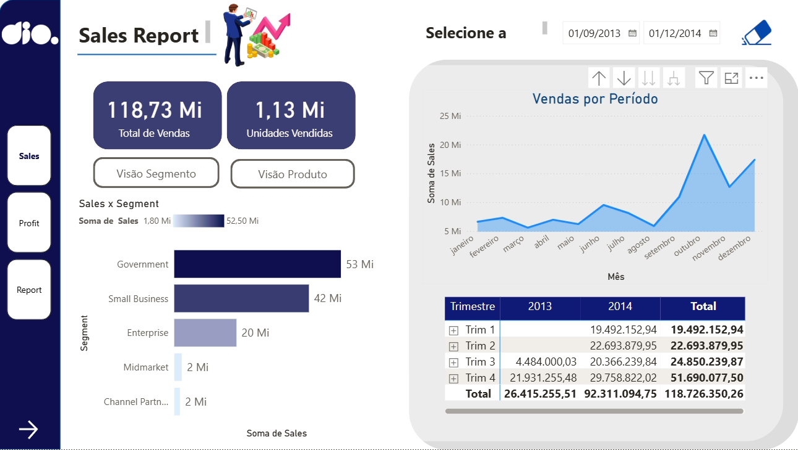

# 📊 Relatório de Vendas e Lucros com Data Analytics com Power BI

## Descrição

Relatório analítico interativo de Vendas e Lucros desenvolvido no Power BI, com três páginas navegáveis: visão geral de vendas por segmento e período, análise detalhada de lucro por país e trimestre, e relatório comparativo de vendas e gross sales — utilizando a base de dados **Financial Sample** da Microsoft.

---

## 📌 Sobre o Projeto

Este projeto foi desenvolvido como **Desafio de Projeto** do módulo **"Criando um Relatório de Vendas e Lucros com Data Analytics com Power BI"**, parte da trilha **Formação Power BI Analyst** da [DIO](https://www.dio.me/).

O objetivo é construir um relatório gerencial com **três páginas distintas**, cada uma com foco analítico específico — vendas, lucro e comparativo — aplicando boas práticas de design, storytelling com dados, e uso avançado de visuais nativos e personalizados do Power BI.

---

## 🗂️ Estrutura do Projeto

```
📁 relatorio-vendas-lucros-power-bi/
│
├── 📄 README.md
├── 📊 relatorio_vendas_lucros.pbix
└── 📁 assets/
    ├── 🖼️ sales_page.png
    ├── 🖼️ profit_page.png
    └── 🖼️ report_page.png
```

---

## 🗃️ Base de Dados

A base de dados utilizada é a **Financial Sample**, planilha pública da Microsoft amplamente utilizada em tutoriais de análise de dados.

| Coluna | Descrição |
|---|---|
| Segment | Segmento de mercado (Government, Small Business, Enterprise, Midmarket, Channel Partners) |
| Country | País de venda (Canada, France, Germany, Mexico, United States of America) |
| Product | Nome do produto |
| Discount Band | Faixa de desconto aplicada |
| Units Sold | Quantidade de unidades vendidas |
| Manufacturing Price | Preço de fabricação |
| Sale Price | Preço de venda unitário |
| Gross Sales | Receita bruta total |
| Discounts | Valor de desconto concedido |
| Sales | Receita líquida de vendas |
| COGS | Custo dos produtos vendidos |
| Profit | Lucro obtido |
| Date | Data da transação |
| Month Number | Número do mês |
| Month Name | Nome do mês |
| Year | Ano da venda |

---

## 📊 O Dashboard

O relatório é composto por **3 páginas navegáveis**, acessíveis pelas abas na parte inferior e por botões de navegação internos.

---

### 📄 Página 1 — Sales (Home Page)

> Visão geral das vendas: KPIs globais, distribuição por segmento e evolução temporal das vendas.

<p align="center">
  
</p>

**Elementos presentes na página:**

- **KPIs de destaque:**
  - 💰 **Total de Vendas:** R$ 118,73 Mi
  - 📦 **Unidades Vendidas:** 1,13 Mi

- **Botões de navegação interna:**
  - `Visão Segmento` — filtra visão por segmento de mercado
  - `Visão Produto` — filtra visão por produto

- **Filtro de período:** Seletor de datas entre `01/09/2013` e `01/12/2014`

- **Gráfico de barras horizontais — Sales x Segment:**
  | Segmento | Vendas |
  |---|---|
  | Government | ~53 Mi |
  | Small Business | ~42 Mi |
  | Enterprise | ~20 Mi |
  | Midmarket | ~2 Mi |
  | Channel Partners | ~2 Mi |

- **Gráfico de área — Vendas por Período:** Evolução mensal das vendas ao longo do ano, com pico expressivo nos meses de outubro e novembro.

- **Tabela de vendas por Trimestre e Ano:**
  | Trimestre | 2013 | 2014 | Total |
  |---|---|---|---|
  | Trim 1 | — | 19.492.152,94 | **19.492.152,94** |
  | Trim 2 | — | 22.693.879,95 | **22.693.879,95** |
  | Trim 3 | 4.484.000,03 | 20.366.239,84 | **24.850.239,87** |
  | Trim 4 | 21.931.255,48 | 29.758.822,02 | **51.690.077,50** |
  | **Total** | **26.415.255,51** | **92.311.094,75** | **118.726.350,26** |

---

### 📄 Página 2 — Profit (Report de Lucro Detalhado)

> Análise detalhada do lucro: decomposição por ano, distribuição por país e segmento, e evolução trimestral.

<p align="center">
  
</p>

**Elementos presentes na página:**

- **Filtros de ano:** `2013` | `2014` (slicers horizontais)

- **Árvore de decomposição (Decomposition Tree):**
  - **Soma de Profit Total:** R$ 16.893.702,26
    - 2013 → R$ 3.878.464,51
    - 2014 → R$ 13.015.237,75
  - Drill-down por **Country** (ano selecionado: 2013)

- **Gráfico de barras horizontais — Lucro por País (2013):**
  | País | Lucro |
  |---|---|
  | Canada | 803.671,78 |
  | France | 811.332,17 |
  | Germany | 1.118.219,47 |
  | Mexico | 592.670,26 |
  | United States | 552.570,83 |

- **Gráfico Radar — Visual Personalizado:** Análise multidimensional do lucro por segmento *(requer instalação do visual customizado `RadarChart1446119667547`).*

- **Treemap — Soma de Profit por Segment:** Representação proporcional da participação de cada segmento no lucro total (Government e Small Business em destaque).

- **Gráfico de cascata (Waterfall) — Soma de Profit por Trimestre:** Visualização de acréscimos de lucro trimestre a trimestre, com indicadores de aumento (verde), diminuição (vermelho) e total (azul).

---

### 📄 Página 3 — Report (Report de Vendas Detalhado)

> Visão comparativa de vendas e gross sales: evolução mensal, desempenho trimestral e análise de crescimento.

<p align="center">
  
</p>

**Elementos presentes na página:**

- **Gráfico de linha — Vendas por Período:**
  - Eixo Y: Soma de Sales e Soma de Profit
  - Eixo X: Meses do ano
  - Pico expressivo nas vendas em **outubro**; lucro mantém-se proporcionalmente estável

- **Tabela de Lucro por Trimestre e Ano:**
  | Trimestre | 2013 | 2014 | Total |
  |---|---|---|---|
  | Trim 1 | — | 2.632.442,94 | **2.632.442,94** |
  | Trim 2 | — | 3.232.378,45 | **3.232.378,45** |
  | Trim 3 | 763.603,03 | 2.738.064,34 | **3.501.667,37** |
  | Trim 4 | 3.114.861,48 | 4.412.352,02 | **7.527.213,50** |
  | **Total** | **3.878.464,51** | **13.015.237,75** | **16.893.702,26** |

- **Gráfico de barras — Vendas e Gross Sales x Período:**
  - Barras ordenadas por valor crescente (março ao outubro)
  - Dois indicadores sobrepostos: **Soma de Sales** (azul claro) e **Soma de Gross Sales** (azul escuro)
  - Outubro registra o maior volume: **~22 Mi** em Gross Sales e **~17 Mi** em Sales
  - Evidencia sazonalidade e impacto de descontos sobre a receita bruta

---

## 💡 Exemplos e Análises

### 📌 Análise 1 — Concentração de Vendas por Segmento

O segmento **Government** lidera com aproximadamente **R$ 53 Mi (44,6%)** do total de vendas, seguido por **Small Business** com R$ 42 Mi (35,4%). Juntos, esses dois segmentos representam cerca de **80% da receita total**, evidenciando alta concentração e a importância estratégica desses clientes.

---

### 📌 Análise 2 — Sazonalidade no Quarto Trimestre

O **Trim 4** concentra mais de **R$ 51,6 Mi** em vendas, o que corresponde a **43,5% do total anual**. O gráfico de vendas por período confirma picos nos meses de outubro e novembro, sugerindo forte sazonalidade no final do ano — possivelmente relacionada a datas comerciais relevantes.

---

### 📌 Análise 3 — Crescimento de 2013 para 2014

O lucro saltou de **R$ 3,87 Mi** (2013) para **R$ 13,01 Mi** (2014), representando um crescimento de aproximadamente **235%**. A árvore de decomposição (Profit Page) permite identificar quais países e segmentos mais contribuíram para esse crescimento.

---

## 🎨 Design e Identidade Visual

| Elemento | Especificação |
|---|---|
| Paleta de cores principal | Azul escuro (#1B2A4A), Azul médio (#2E75B6), Cinza claro (#F2F2F2) |
| Fonte | Segoe UI |
| Estilo dos cartões KPI | Caixas arredondadas com fundo azul escuro e texto branco |
| Navegação | Abas inferiores (Sales, Profit, Report) + botão "Home Page" no cabeçalho |
| Logo | DIO (canto superior esquerdo) |
| Tema geral | Corporativo / Financeiro |

---

## 🛠️ Recursos do Power BI Aplicados

- ✅ Gráfico de Área
- ✅ Gráfico de Barras Horizontais
- ✅ Gráfico de Linhas com múltiplas métricas
- ✅ Gráfico de Barras Verticais com rótulos de dados
- ✅ Gráfico de Cascata (Waterfall Chart)
- ✅ Treemap
- ✅ Árvore de Decomposição (Decomposition Tree)
- ✅ Radar Chart (visual personalizado via AppSource)
- ✅ Tabela com formatação condicional
- ✅ Slicers (filtros de data e ano)
- ✅ Botões de navegação entre páginas
- ✅ KPI Cards
- ✅ Medidas DAX (Soma de Sales, Soma de Profit, Soma de Gross Sales)

---

## 📚 Curso

**Formação Power BI Analyst — DIO**
- 🎓 Módulo: *Criando um Relatório de Vendas e Lucros com Data Analytics com Power BI*
- 👩‍🏫 Instrutora: Juliana Mascarenhas

---

## 🔗 Referências

- [DIO — Digital Innovation One](https://www.dio.me/)
- [Financial Sample — Microsoft](https://learn.microsoft.com/pt-br/power-bi/create-reports/sample-financial-download)
- [Documentação Power BI](https://learn.microsoft.com/pt-br/power-bi/)
- [AppSource — Power BI Visuals](https://appsource.microsoft.com/pt-br/marketplace/apps?product=power-bi-visuals)